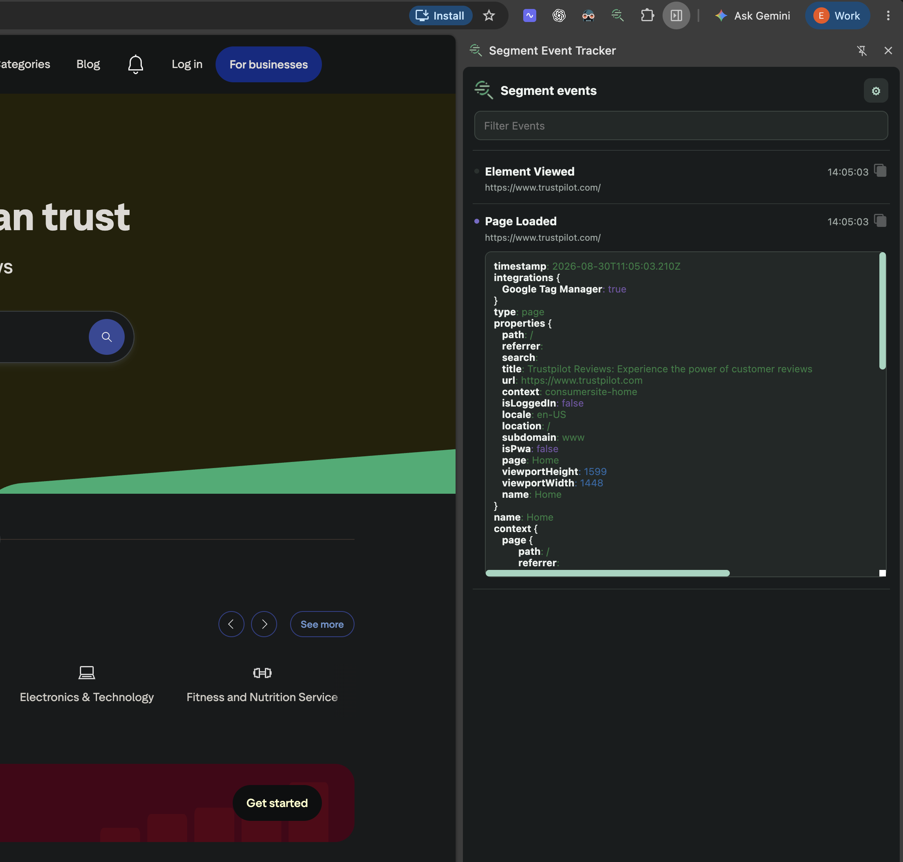
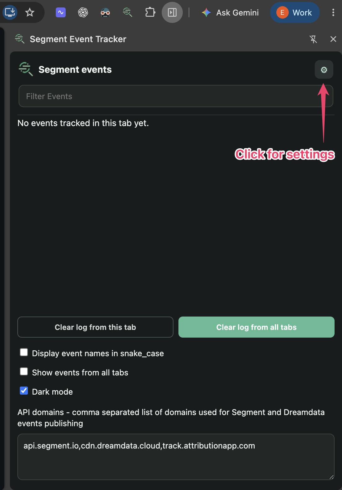

# Segment Event Tracker

A Chrome side-panel extension for inspecting Segment-compatible events as they leave the page. It makes event validation easier while you develop, QA, or debug an analytics integration.

Forked from [Martin Mouritzen's Segment Chrome Extension](https://github.com/martinmouritzen/segment-chrome-extension).

## What it tracks

The extension observes outgoing Segment-compatible API calls and shows events sent to:

- [Segment](https://segment.com/)
- [RudderStack](https://www.rudderstack.com/)
- [Dreamdata](https://dreamdata.io/)
- [Attribution](https://attributionapp.com/)

## A side panel built for event debugging

- Keep the tracker open beside the page while you reproduce a flow.
- Filter the live event feed and expand an event to inspect its full payload.
- Copy event details directly from the feed.
- View events from the current tab or, when needed, every open tab.
- Display event names in `snake_case`.
- Clear the current tab's log or every tab's log.
- Use dark mode and configure the API domains the extension should monitor.

## Screenshots

### Inspect events live

### Configure the tracker

## Install from the Chrome Web Store

The Chrome Web Store listing is coming soon. This README will be updated with the installation link once the extension is published.

## Develop locally

1. Clone this repository.
2. In Chrome, open **More tools → Extensions**.
3. Enable **Developer mode**.
4. Select **Load unpacked** and choose the cloned repository folder.
5. Open the Segment Event Tracker side panel and start testing events.

Issues and pull requests are welcome.
